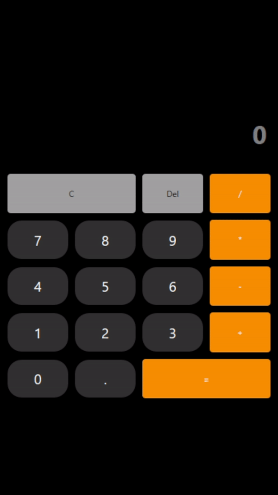

# Simple Calculator GUI App

## Author

[Asmaa Hamid](https://linktr.ee/asmaahamid02)

## Description

> This is a simple calculator GUI app implemented using PyQt6 and python with simple arithmetic operations (addition, subtraction, multiplication, division)

## Key concepts

1. Python basics
2. Class implementation
3. Inheritance
4. Package integration
5. Error handling
6. Virtual environments

## Technologies

1. [Python3](https://docs.python.org/3/)
2. [PyQt6](https://www.riverbankcomputing.com/static/Docs/PyQt6/module_index.html): Python binding of the GUI toolkit Qt to implement python GUIs.

## Demo

<!--markdownlint-disable MD033-->


## How to run

1. Install Python

   - [Python](https://www.python.org/downloads/)
   - [Python Installation Guide](https://realpython.com/installing-python/)

2. Install pipenv for virtual environment (optional)

   ```bash
   pip install pipenv
   ```

3. Create virtual environment (optional)

   ```bash
   pipenv install
   pipenv shell
   ```

   or

   ```bash
   python -m venv venv
   ```

4. Install pyqt6

   Enter the virtual environment (optional)

   ```bash
   ##pipenv
   pipenv shell

   ##default
   source venv/Scripts/activate  #linux/mac
   #or
   source venv/bin/activate #linux/mac
   #or
   venv\Scripts\activate #windows
   ```

   Install pyqt6

   ```bash
   #pipenv
   pipenv install pyqt6

   #pip
   pip install pyqt6
   ```

5. Run the project

   ```
   python calculator.py
   ```
